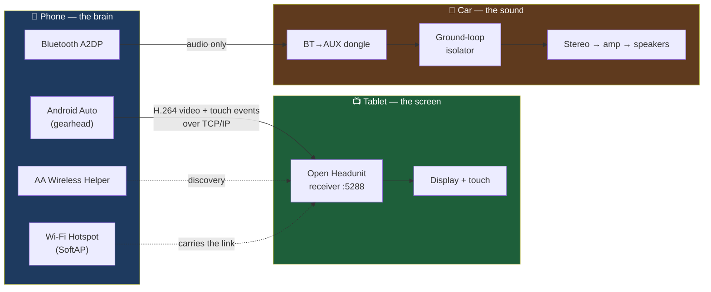

# CarDeck

**A wireless Android Auto head unit built from a spare Android tablet — no head unit, no subscription, no proprietary software.**

Most cars either ship with a locked-down infotainment screen or nothing at all. Aftermarket Android Auto head units cost real money and mean pulling your dashboard apart. CarDeck is the other route: a tablet you already own, suction-mounted, receiving Android Auto wirelessly from your phone — while your car's own stereo keeps playing the audio.

This repo is the complete engineering record of a working installation: architecture, exact settings, the protocol details that aren't documented anywhere else, diagnostic tooling, and every dead end so you don't have to walk down them.

> **Status:** Daily-driven and stable. Video, touch, navigation, media control and a car-only automatic audio profile all work. See [Known Limitations](#known-limitations).

---

## What it actually does

**The key design decision:** video and audio travel on *completely separate paths*. The tablet gets picture and touch over Wi-Fi; the car speakers get sound over Bluetooth, straight from the phone. The tablet never plays a sound. This is deliberate — see [Why audio is split off](docs/04-audio-chain.md#why-the-tablet-is-muted).

---

## Bill of materials

| # | Item | Role | Approx. cost |
|---|------|------|-------------|
| 1 | Android phone with Android Auto | Source — runs Maps, Spotify, calls | *owned* |
| 2 | Android tablet, Wi-Fi only is fine | Display + touchscreen | *owned / used* |
| 3 | [Open Headunit](https://github.com/andreknieriem/open-headunit) (FOSS) | The receiver app | free |
| 4 | AA Wireless Helper | Phone-side discovery | free |
| 5 | Bluetooth→AUX dongle | Audio into the car stereo | ~₹600 / $8 |
| 6 | 3.5 mm ground-loop isolator | Kills 12 V electrical noise | ~₹300 / $4 |
| 7 | Tablet mount + USB-C car charger | Physical install | ~₹800 / $10 |

**No paid software. No rooting. No dashboard disassembly.**

The reference build used a Galaxy Tab S9 FE+ and a Galaxy S25 Ultra, but nothing here is Samsung-specific except the automation recipes, which are called out where they appear.

---

## Documentation

| Document | What's in it |
|---|---|
| **[01 — Architecture](docs/01-architecture.md)** | System diagrams, network topology, connection sequence, state machine |
| **[02 — Hardware Specs](docs/02-hardware-spec.md)** | Every component, every measured number |
| **[03 — Setup Guide](docs/03-setup-guide.md)** | 👈 **Start here.** Step-by-step build manual |
| **[04 — Audio Chain](docs/04-audio-chain.md)** | Ground loops, isolators, and the car-only EQ profile |
| **[05 — Protocol Notes](docs/05-protocol-notes.md)** | Reverse-engineered AA wireless internals |
| **[06 — Diagnostics](docs/06-diagnostics.md)** | Drive logging, what the numbers mean |
| **[07 — Troubleshooting](docs/07-troubleshooting.md)** | Symptom → root cause → fix, including dead ends |
| **[08 — Roadmap](docs/08-roadmap.md)** | Smart dash cam and what comes next |

---

## Quick start

If you just want it working and don't care why:

1. Install **Open Headunit** on the tablet, **AA Wireless Helper** on the phone.
2. On the tablet: Settings → ADVANCED → **Helper Connection Strategy = Phone Hotspot (Host)**.
3. On the tablet: **Audio Sink = OFF**, **Screen orientation = Landscape**, **Pixel density = L (218)**.
4. On the phone: hotspot **Band = 2.4 GHz**, and pair the Bluetooth audio dongle.
5. In the car: turn on the hotspot, open Open Headunit, tap **Wi-Fi**.

Then read [03 — Setup Guide](docs/03-setup-guide.md) properly, because steps 2–4 are each there for a reason that cost a drive to learn.

---

## The three problems that nearly killed this project

Every one of these presents as "it just doesn't work" with no useful error message. All three are solved in this repo.

### 1. Discovery deadlock — the phone never finds the tablet
Both sides sit in "SEARCHING" forever. The cause is a **discovery protocol mismatch**: the tablet defaults to *Google Nearby* while the helper uses *Shared Wi-Fi / Hotspot*, so both ends listen and neither advertises. One setting fixes it. → [Troubleshooting §1](docs/07-troubleshooting.md#1-the-phone-never-finds-the-tablet)

### 2. Video corruption — the screen smears into garbage while driving
Macroblock smearing that made the display unreadable at highway speed. The instinct is "weak signal" or "bad decoder". It was neither — signal was **−25 dBm, point-blank** while throughput collapsed to **1–6 Mbps**. The real cause: single-radio **STA+AP channel collision**. The phone was serving its hotspot on *the exact same channel* as the home Wi-Fi it was still joined to. → [Troubleshooting §2](docs/07-troubleshooting.md#2-video-corrupts-into-macroblocks)

### 3. Flat bass — fixing the noise broke the sound
A ground-loop isolator cured a PWM whine from LED strips on the 12 V rail (100% → 5%) but its undersized transformer rolled off the low end. Fixed with a compensating EQ curve that is **scoped to the car only** — it must not follow you to your headphones. → [Audio Chain](docs/04-audio-chain.md)

---

## Known limitations

| Limitation | Why | Workaround |
|---|---|---|
| Orientation is fixed at connect time | Android Auto negotiates screen geometry **once** during handshake and cannot renegotiate | Lock the app to Landscape; rotating mid-session requires a reconnect |
| Tablet battery percentage can't show in the AA UI | A head unit cannot inject a battery sensor; the icon shown belongs to the *phone* | Swipe down on the tablet |
| Tablet can't be the hotspot on Wi-Fi-only SKUs | No cellular modem, so no tethering | Phone hosts the hotspot |
| An armed-but-idle receiver is **not** free | Measured ~1177 device-wakeup events with zero wakelocks held | Press the tablet's power button when parking |
| Bass recovery is partial | An EQ pushes more signal *into* the transformer; it can't restore what the transformer blocks | Isolated DC-DC supply is the permanent fix |

---

## Contributing

Different phone, different tablet, different car — results will vary, and that's exactly the data this project needs. Please open an issue with your hardware combination and what did or didn't work. Diagnostic captures are especially welcome; see [06 — Diagnostics](docs/06-diagnostics.md) for the tooling.

**Scrub your logs before posting.** They contain SSIDs, BSSIDs and MAC addresses.

## Safety

This is a screen in a moving vehicle. Mount it where it does not block your view or sit in an airbag deployment path, set it up while parked, and check your local law on screen placement. If the picture corrupts while you're driving, **ignore it and pull over** — don't debug at speed.

## License

MIT — see [LICENSE](LICENSE). Not affiliated with Google or any device manufacturer. "Android Auto" is a trademark of Google LLC.
