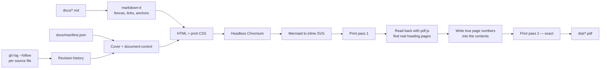

# Documentation build pipeline

Turns the Markdown in `docs/` into controlled, versioned PDFs.

```bash
cd build
npm install
npm run build
```

Output lands in `dist/`. Requires Node 18+ and a local Chrome or Edge (set `CHROME_PATH` if it is somewhere unusual).

```bash
node build-docs.mjs                # everything, plus the bound manual
node build-docs.mjs --only CD-004  # one document
node build-docs.mjs --no-manual    # skip the combined volume
```

---

## What it produces

| Artefact | Contents |
|---|---|
| `CarDeck-CD-00N-<Title>-v<version>.pdf` | One controlled document, with cover, revision history and contents |
| `CarDeck-Technical-Manual-v<version>.pdf` | All documents bound as one volume with part dividers |
| `build-record.json` | Machine-readable provenance for the whole issue |

---

## How it works



### Diagrams are vector, not images

Mermaid renders to inline SVG inside the page, so diagrams are typeset with the prose and stay sharp at any zoom or print size. Nothing is rasterised, and no image files are checked in — the diagram source in the Markdown is the single source of truth for both the GitHub view and the PDF.

### Diagrams are recoloured for print

The `style` directives in the Markdown use saturated dark fills, chosen to read well against GitHub's dark background. On white paper they are heavy and fight the document palette, so each is remapped to a light tint of the same semantic colour and its white label text becomes ink.

This happens on the **SVG markup as a string**, before it enters the DOM. Rewriting afterwards does not survive printing: the browser normalises inline styles and the original `!important` declarations win back. That cost an afternoon; it is why the code looks the way it does.

The palette is the `TINT` table in `build-docs.mjs`, keyed by the source colour. To restyle, edit that table — not the diagrams.

### Page numbers are exact, not estimated

A first pass simulates pagination in the browser, honouring `break-inside: avoid` and CSS margin collapsing, measured at the true printable box (176 × 259 mm). That gets close but not exact — only the print engine knows where a heading really lands.

So the document is printed once, read back with `pdf.js` to find the actual page of every heading (identified by glyph size, since headings are set larger than body text), those numbers are written into the contents, and it is printed again. Filling the digits cannot reflow the page — the leader-dot run absorbs the width change — so the second print is exact.

Verified: **168 of 168 contents entries correct across 163 pages**, zero drift.

### Revision history comes from git

Each document's revision table is derived from `git log --follow` on its source file. Revisions are lettered A, B, C… from that file's first commit, so a document tracks its own change count independently of the release version. There is no hand-maintained revision table to drift out of date.

If the working tree is dirty, the commit hash is suffixed `+` and the build prints a warning. Do not issue documents from a dirty tree.

### Cross-references resolve to document IDs

A printed page cannot follow a hyperlink, so `[Audio Chain](04-audio-chain.md)` renders as the link text followed by a `CD-004` tag. The mapping comes from `docs/manifest.json`.

---

## Versioning

| Input | Controls |
|---|---|
| `VERSION` | The version stamped on every PDF and in every filename |
| `docs/manifest.json` | Document IDs, titles, status, audience, ordering |
| git history | Per-document revision letters and dates |
| `CHANGELOG.md` | The human-readable record of what changed |

To issue a new version:

```bash
# 1. commit the documentation changes first — revision history is derived from git
git add docs/ && git commit -m "docs: <what changed>"

# 2. bump the version and record the change
echo "1.1.0" > VERSION
$EDITOR CHANGELOG.md

# 3. rebuild and tag
cd build && npm run build && cd ..
git add VERSION CHANGELOG.md && git commit -m "release: v1.1.0"
git tag -a v1.1.0 -m "v1.1.0"
```

Generated PDFs are **not committed** — they are build outputs, they are large, and they rebuild deterministically from the source. Attach them to the GitHub release instead:

```bash
gh release create v1.1.0 dist/*.pdf --notes-from-tag
```

If you would rather track them in git, drop the `dist/*.pdf` line from `.gitignore`.

---

## Files

| File | Purpose |
|---|---|
| `build-docs.mjs` | The whole pipeline |
| `styles/print.css` | Print stylesheet — page setup, typography, callouts, figures |
| `package.json` | Dependencies: markdown-it, puppeteer-core, mermaid, pdfjs-dist |
| `.tmp/` | Intermediate HTML and probe PDFs, safe to delete |

Puppeteer is `puppeteer-core` — it drives the Chrome or Edge you already have rather than downloading its own ~200 MB Chromium.

---

## Troubleshooting the build

| Symptom | Cause |
|---|---|
| `No Chrome or Edge installation found` | Set `CHROME_PATH` to your browser binary |
| A diagram appears as plain monospace text | Mermaid failed to parse it; the build prints the parser error and falls back rather than dying |
| `N toc entries unresolved` | A contents entry could not be matched back in the printed PDF, usually a heading whose glyphs do not round-trip. That entry keeps its estimated page number. |
| `Built from a dirty working tree` | Commit first — the revision history on the cover will otherwise not match what you shipped |
| Colours look wrong in a diagram | Add the source colour to the `TINT` table in `build-docs.mjs` |
