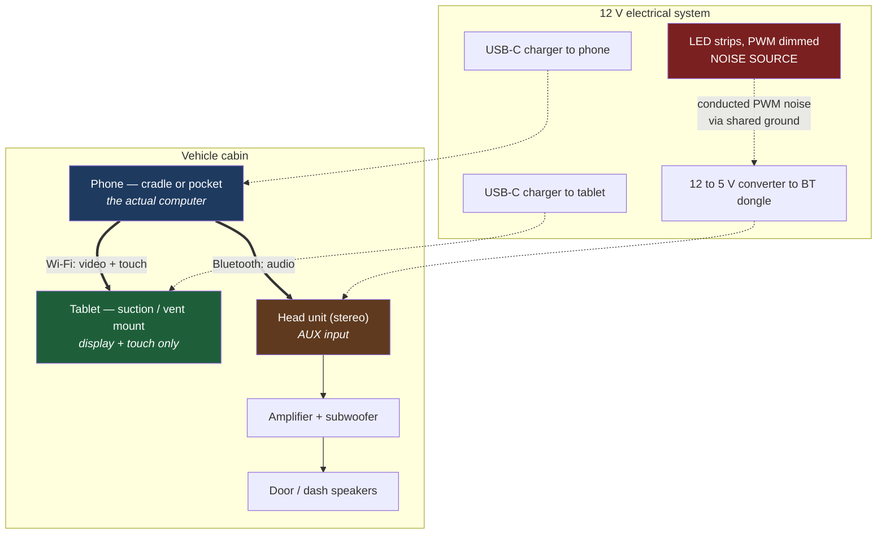
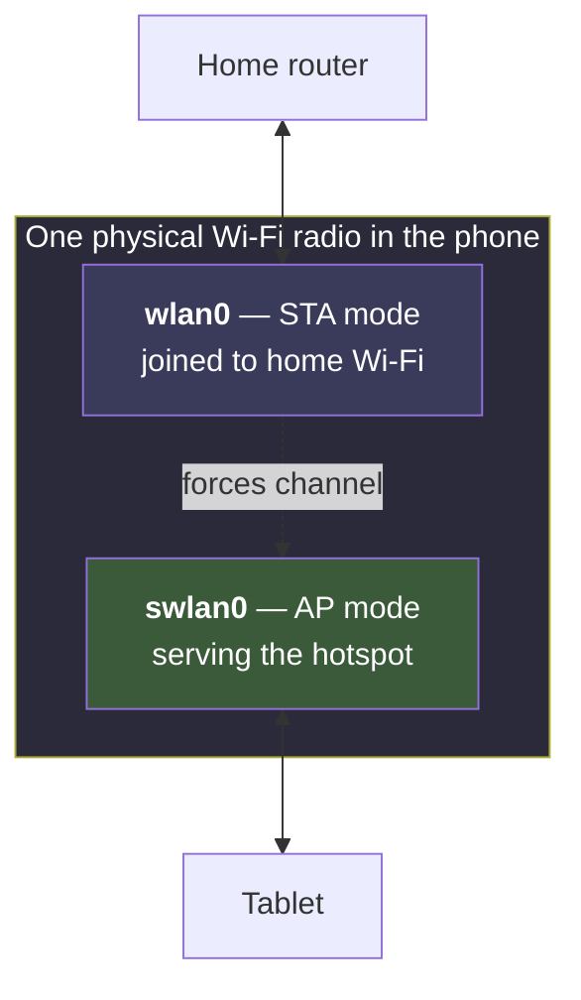
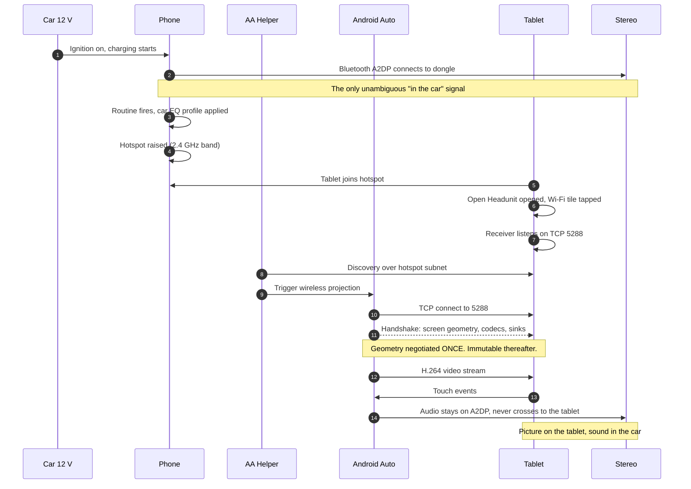
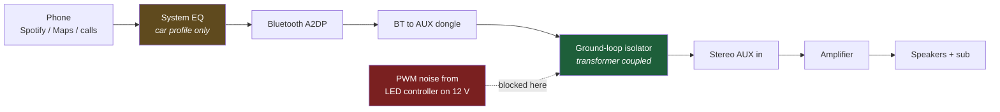
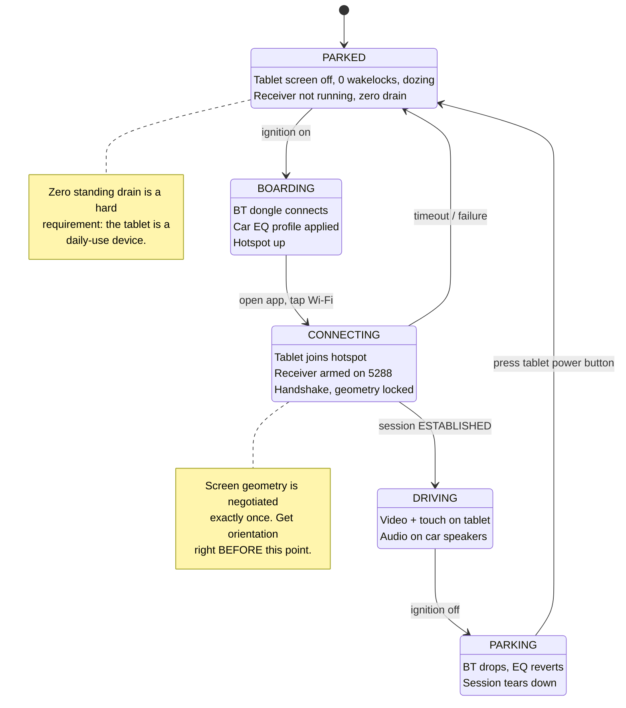
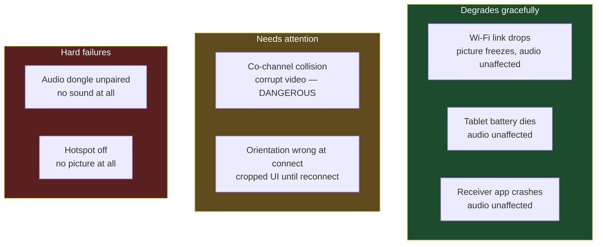

# 01 — Architecture

## Contents
- [Design principles](#design-principles)
- [Physical layout](#physical-layout)
- [Network topology](#network-topology)
- [Connection sequence](#connection-sequence)
- [Audio signal path](#audio-signal-path)
- [Drive lifecycle](#drive-lifecycle)
- [Trust and failure boundaries](#trust-and-failure-boundaries)

---

## Design principles

Four rules drove every decision in this build. When something had to give, these are what it was measured against.

1. **The car stereo owns the audio.** The tablet is a display and a touchscreen. Nothing else. Sound through real speakers and a real amplifier beats anything a tablet can do, and it keeps phone calls on a path the driver already knows.
2. **Zero standing battery drain.** The tablet is a daily-use device, not a dedicated car computer. It must cost nothing when parked.
3. **The car context must be unambiguous.** Automation triggers have to fire in the car and *only* in the car. This is much harder than it sounds — see [the disambiguation problem](#the-context-disambiguation-problem).
4. **Everything reversible.** No root, no custom ROM, no soldering into the car harness. Every change can be undone from a settings menu.

---

## Physical layout



The dashed red path is what caused the audio noise problem. It is not a signal path — it is a *power* path — which is exactly why it took so long to find. See [04 — Audio Chain](04-audio-chain.md).

---

## Network topology

This is the part most DIY guides get wrong, and the source of the worst failure mode in the whole system.

### The single-radio constraint

A phone has **one** Wi-Fi chip. When it hosts a hotspot while also joined to another Wi-Fi network, it runs **STA+AP concurrency** — station mode and access point mode time-sliced on one radio.



Vendors resolve the concurrency problem by **forcing the SoftAP onto the channel the station is already using.** That is efficient — one channel, no hopping — right up to the moment it is not.

### The failure: co-channel collision

| State | STA channel | AP channel | Result |
|---|---|---|---|
| Broken | 5745 MHz (home) | 5745 MHz (forced) | Hotspot transmits **on top of** the home network. Video stream collides with all household traffic. |
| Fixed | 2462 MHz (2.4 GHz) | 5745 MHz | Different bands. No contention. |

The tell-tale signature — and the reason this is worth writing down — is that **it does not look like interference**:

```
RSSI:          -25 dBm      <- point-blank, as strong as Wi-Fi gets
Link speed:    104 Mbps     <- negotiated fine
Rx Link speed: 1-6 Mbps     <- actual throughput, collapsed
```

Strong signal + collapsed throughput = **contention**, never range. If you take one diagnostic heuristic from this repo, take that one.

The symptom also self-heals as you drive away from home — the station link drops, the radio dedicates itself to the AP, and the picture recovers. Which is precisely why it always looked like "a problem at the start of the drive" and never reproduced on the bench.

**Fix:** set the hotspot band to 2.4 GHz. Note the band preference is **not applied while the station holds a 5 GHz link** — you must cycle the hotspot off and on for it to re-pick.

Measured result after the fix: **866 Mbps Tx / 866 Mbps Rx**, session established in 4 seconds, rendering at 50 FPS with a 5 ms frame time.

---

## Connection sequence

What actually happens between turning the key and seeing a map.



Step 11 is the architectural constraint that explains a whole class of bugs: **the handshake happens once**. Screen size, orientation and margins are baked in at that moment. Rotate the tablet mid-session and the picture breaks; there is no renegotiation path in the protocol. The only fix is deterministic orientation before connect.

---

## Audio signal path



The isolator breaks the ground path that let 12 V rail noise into the audio — but a transformer that blocks DC also attenuates the lowest audio frequencies. The EQ stage exists to compensate. Full analysis in [04 — Audio Chain](04-audio-chain.md).

---

## Drive lifecycle



### The context disambiguation problem

The obvious automation is *"when the tablet joins the phone hotspot, launch the head unit app."* **Do not build this.** If you ever tether the tablet to your phone for ordinary work — on a train, in a café — the app will launch over whatever you are doing.

Enumerating the available signals and which actually mean "in the car":

| Signal | In the car? | Elsewhere too? | Usable as a trigger |
|---|---|---|---|
| Phone hotspot active | yes | yes, tethering anywhere | no — ambiguous |
| Tablet on hotspot SSID | yes | yes, same | no — ambiguous |
| Charging | yes | yes, constantly | no — ambiguous |
| Phone-to-tablet Bluetooth | yes | yes, at home | no — ambiguous, and does not auto-connect |
| **Bluetooth to the car audio dongle** | yes | **never** | **yes — the only clean signal** |

**Verified empirically:** hotspot up + tablet armed on :5288 + audio dongle *not* connected produced **zero projection sessions**. The ambiguous case is safe by construction — but only because nothing was built on it.

**Corollary that cost a full test cycle:** two Android devices share no auto-connecting Bluetooth profile. A headset connects automatically because it is an audio *sink*; a phone and a tablet are both sources. The only linkable profile between them is PAN tethering, which vendors gate behind "turn off Wi-Fi to use Bluetooth tethering" — and Wi-Fi is exactly what the projection needs. That path self-defeats. [Full writeup](07-troubleshooting.md#dead-end-b--phone-to-tablet-bluetooth-as-a-trigger).

---

## Trust and failure boundaries



The important structural property: **audio never depends on video.** Every Wi-Fi-side failure leaves the music playing and navigation audible. That falls directly out of the decision to split the two paths, and it is the most valuable safety property of the design — a failure in the screen never becomes a failure in the car.

---

**Next:** [02 — Hardware Specs](02-hardware-spec.md) · [03 — Setup Guide](03-setup-guide.md)
