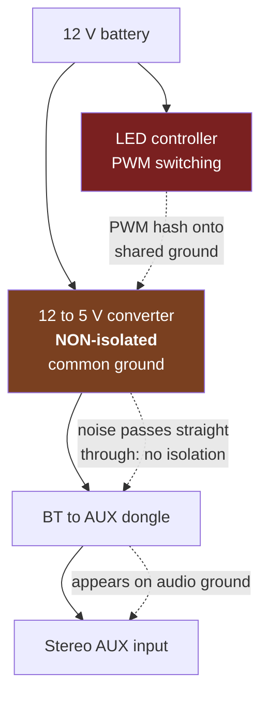
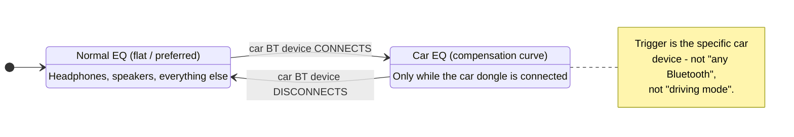
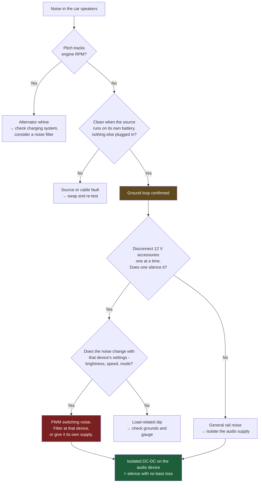

# 04 - Audio Chain

How sound gets from the phone to the speakers, why it picked up a beep along the way, and what fixing that beep cost.

---

## Why the tablet is muted

The tablet outputs **no audio at all**. This is a design decision, not a limitation, and it is worth defending.

| | Audio via tablet | Audio via car stereo (chosen) |
|---|---|---|
| Quality | Tablet speakers or a USB-C DAC | Real amplifier, real speakers, subwoofer |
| Phone calls | Mic routing gets complicated | Works exactly as the driver already expects |
| Failure mode | Wi-Fi hiccup silences the music | **Wi-Fi failure cannot touch the audio** |
| Ground loop | Re-created the moment you charge the tablet | Isolated at one well-chosen point |
| Latency | Video pipeline latency added | Direct A2DP |

That third row is the decisive one. Because audio never traverses the Wi-Fi link, **no video failure can ever silence your navigation prompts or your phone call.** The screen can freeze, corrupt, or die completely and the car keeps working as a car. In a moving vehicle, that property is worth more than any convenience the alternative offers.

**A trap on modern tablets:** many recent devices dropped analogue audio out over USB-C (accessory mode). They report `usb_headset` support, so it looks feasible, but it requires an *active* USB-C DAC - and since that port is also the charging port, you would additionally need a power-delivery passthrough hub. All to arrive at a worse outcome than the free option.

---

## The noise problem

### Symptom

A constant beep through the car speakers. Present with nothing playing. Loud enough to be genuinely unpleasant.

### What it was not

| Hypothesis | Ruled out by |
|---|---|
| Alternator whine | Pitch did not track engine RPM |
| Plain audio ground loop | A phone on its own battery via 3.5 mm was completely clean |
| Faulty dongle | Noise present with different sources |
| Bad AUX cable | Swapping changed nothing |

### The actual cause

Two observations cracked it:

1. **Disconnecting the Bluetooth interior LED strips silenced the beep completely.**
2. **The beep's character changed with LED colour and brightness.**

That second one is the fingerprint of **PWM dimming noise**. LED controllers dim by switching the supply on and off very fast; changing brightness changes the duty cycle, changing colour changes which channels switch. That switching puts high-frequency hash onto the shared 12 V rail - and, critically, onto the shared **ground**.



### Why the existing converter did not help

There was already a 12 V → 5 V converter feeding the dongle. It made no difference, because **voltage conversion and galvanic isolation are different properties.**

| Property | Non-isolated buck converter | Isolated converter |
|---|---|---|
| Changes voltage | ✅ | ✅ |
| Input and output share a ground | ✅ **yes** | ❌ no |
| Breaks a ground loop | ❌ **no** | ✅ yes |

Nearly every cheap automotive USB adapter is the non-isolated kind. If a ground loop is your problem, adding one of these does nothing at all. This is a common and expensive misunderstanding.

---

## The isolator, and what it cost

A 3.5 mm ground-loop isolator is a pair of small audio transformers. Signal crosses magnetically; the ground connection is physically broken. Noise riding on the ground has no path through.

**Result: beep went from 100% to about 5%.** The fix worked.

**And the bass collapsed.**

### Why a transformer eats bass

Transformer coupling is inherently high-pass. The impedance of the primary winding falls with frequency, so low frequencies see progressively less of the winding and more of a short.

```
Cutoff frequency  ~  R_load / (2 * pi * L_primary)
```

A large-cored transformer with high primary inductance passes down to 20 Hz cleanly. A transformer that fits inside a ₹300 dongle barrel does not - and its roll-off lands right in the range that carries the weight of music.

| Frequency | Direct | Through a cheap isolator | Loss |
|---|---|---|---|
| 20 Hz | 0 dB | −12 dB | sub-bass, mostly gone |
| 40 Hz | 0 dB | −8 dB | severe |
| 63 Hz | 0 dB | −6 dB | severe |
| 100 Hz | 0 dB | −4 dB | clearly audible |
| 125 Hz | 0 dB | −3 dB | clearly audible |
| 250 Hz | 0 dB | −1 dB | marginal |
| 500 Hz + | 0 dB | 0 dB | transparent |

*Illustrative shape, not a measured curve - the exact corner depends on your specific isolator. The character is what matters: everything below roughly 250 Hz loses level, and it gets worse the lower you go.*

This is the **expected failure mode of cheap isolators** and worth knowing before you buy: you are trading low end for silence.

---

## Recovering the bass

Three levers, in order of effectiveness. Do them in this order - the free mechanical ones first.

### 1. Amplifier sensitivity (biggest single win)

The isolator drops the signal *level* as well as the low frequencies. Turning up the amplifier's input sensitivity compensates for the level loss directly, in the analogue domain, before any of it matters.

**Set Sensitivity toward the most-sensitive end** (0.3 V on a 0.3-5.0 V control).

On compact amplified subwoofer units this is usually a **recessed screwdriver trim-pot**, not a knob, and it is genuinely easy to miss - look next to the phase switch. Check your unit's manual: these controls are often documented even when they are not obvious on the enclosure.

### 2. Low-pass filter

**Set the low-pass to its highest setting** (typically 120 Hz).

This widens the band the subwoofer handles upward, so the sub covers more of the region the isolator thinned instead of leaving it to the door speakers, which are behind the same isolator.

### 3. EQ compensation (the software half)

Apply the inverse of the roll-off curve. A shelf that lifts the lowest bands hardest:

| Band | Boost | Reasoning |
|---|---|---|
| 63 Hz | **+6 dB** | Worst-affected region |
| 125 Hz | **+4 dB** | Substantially affected |
| 250 Hz | **+2 dB** | Mildly affected |
| 500 Hz and up | 0 dB | Transformer is transparent here |

```
 +6 ┤ █
 +5 ┤ █
 +4 ┤ █  █
 +3 ┤ █  █
 +2 ┤ █  █  █
 +1 ┤ █  █  █
  0 ┼─█──█──█──●───●───●───●───●───●
    └─────────────────────────────────
     63 125 250 500  1k  2k  4k  8k 16k
```

**Be honest about what this achieves.** EQ pushes *more signal into* the transformer. It cannot restore frequencies the transformer physically blocks, and pushing too hard risks distortion and wasted amplifier headroom. It recovers a meaningful part of the punch, not all of it. Combined with the two trim-pot adjustments it gets you most of the way back; the permanent fix is [eliminating the need for the isolator](#the-permanent-fix).

---

## The car-only EQ profile

**A global EQ change is the wrong answer.** That bass boost exists to cancel a specific transformer in a specific car. On your headphones it is just wrong - muddy, bloated, fatiguing.

The EQ must apply **only when the car audio device is connected**, and revert the instant it disconnects.



### Building it (Samsung Modes and Routines)

Most Android automation platforms can express this; the vendor routine engine is used here because it needs no third-party app and handles the revert automatically.

**Settings → Modes and Routines → Routines tab → `+`**

**The trigger - "If":**
1. Tap **Add what will trigger this routine**
2. Under *Connections*, choose **Bluetooth device**
3. Tap **Device - None selected**
4. Tick **your car audio dongle only** - verify nothing else is ticked
5. **OK**
6. Leave the radio on **Connected**
7. **Done**

**The action - "Then":**
1. Tap **Add what this routine will do**
2. **Sounds and vibration** → **Equaliser**
3. Select **Custom** → **Done**

**Save:**
- Confirm the editor shows a **"When routine ends"** section - that is the automatic revert, and it is what protects your other devices. Do not remove it.
- Tap **Save** and name it.

> **Known automation quirk:** the routine editor's Save button rejects synthetic input events. Scripted setup via `adb input tap` will compose the routine correctly and then silently fail to save it. **Tap Save with your finger.** Four different coordinates were tried during this build; every other control in the same dialog responded and Save never did.

### Why other devices are safe

Three independent layers:

1. **The trigger names one specific device.** Other Bluetooth devices do not match, so the routine never fires for them.
2. **The automatic revert** restores the previous preset the moment the car device disconnects.
3. **Your everyday preset stays untouched.** The boosted values live inside the *Custom* preset, which nothing selects except this routine.

### Verifying

1. Connect the car device → open the equaliser → **Custom** should be selected, showing the boost curve.
2. Disconnect → re-open → back to your normal preset.
3. Connect headphones → confirm they sound as they always did.

---

## The permanent fix

The isolator treats the symptom. The disease is PWM noise on the 12 V rail, and it can be cured at the source - after which you can remove the isolator and get your bass back for free.

Options, cheapest first:

| Approach | Cost | Effect |
|---|---|---|
| **Filter at the noise source** - ferrite choke + 1000 µF electrolytic + 0.1 µF ceramic across the LED controller's 12 V input | ~₹150 | Attacks the actual cause. Try this first. |
| **Re-feed the LED controller** from its own fused line and ground, direct to the battery | wiring only | Removes the shared path entirely |
| **Isolated DC-DC converter** for the audio dongle (e.g. B0505S module) | ~₹300 | Galvanic isolation *in the power domain*, where it belongs - no audio transformer, no bass loss |
| **USB isolator** (e.g. ADuM3160-based) | ~₹1000 | Same principle, pre-packaged |

The isolated DC-DC is the elegant answer: it puts the isolation barrier in the **power** path instead of the **audio** path. The ground loop is broken exactly where it forms, the audio signal is never transformer-coupled at all, and the bass is untouched. If you are buying anything, buy that rather than a better audio isolator.

---

## Diagnostic flow



---

**Next:** [05 - Protocol Notes](05-protocol-notes.md) · [07 - Troubleshooting](07-troubleshooting.md)
