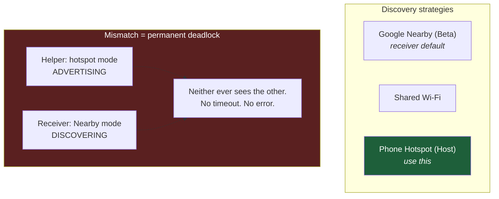

# 05 — Protocol Notes

Reverse-engineered details of the Android Auto wireless projection flow, gathered from source reading, `logcat`, and a lot of failed experiments.

> **Scope and caveats.** This documents observed behaviour of specific versions on specific devices. Android Auto changes between releases and *has already broken one of the mechanisms below*. Treat it as a map of the territory, not a stable API. Nothing here bypasses DRM or security — it is all about getting two devices you own to talk to each other.

---

## Transport basics

| Property | Value |
|---|---|
| Head unit TCP port | **5288** (hex `14A8`) |
| Bind address | `::` — all interfaces, IPv4 and IPv6 |
| Video codec | H.264, hardware decoded |
| Reverse-direction port | 5277 — a *different* topology, see [below](#the-reverse-topology-red-herring) |

### Checking session state without any app

`/proc/net/tcp` and `/proc/net/tcp6` expose socket state directly. Port 5288 is `14A8` in hex; column 4 is the state.

```bash
# Is the receiver armed?  (0A = LISTEN)
adb shell "cat /proc/net/tcp /proc/net/tcp6" | awk '$2 ~ /14A8$/ && $4 == "0A"'

# Is a session live?  (01 = ESTABLISHED)
adb shell "cat /proc/net/tcp /proc/net/tcp6" | awk '$2 ~ /14A8$/ && $4 == "01"'
```

This check is **UID-independent**, so it survives app reinstalls and version changes — which is exactly why the [logging tooling](06-diagnostics.md) uses it instead of parsing app logs.

---

## Discovery: three protocols, one deadlock

The phone-side helper and the tablet-side receiver must agree on *how* to find each other. They do not negotiate this. If they disagree, both sides wait forever with no error.



The deadlock signature in the tablet log:
```
NearbyManager: Starting Nearby (Discoverer only)
```
while the phone helper simultaneously displays `SEARCHING`. **Both sides discovering, neither advertising.**

**Fix:** set the receiver's *Helper Connection Strategy* to **Phone Hotspot (Host)**.

---

## The broadcast fallback

Before the strategy mismatch was found, projection was forced open a different way. It works, it is genuinely useful for bench testing, and it is **not viable in a car** — but the details explain a lot about how the stack is wired.

Android Auto exposes a receiver that starts wireless projection against an explicit IP and port:

```bash
adb shell am broadcast \
  -n com.google.android.projection.gearhead/com.google.android.apps.auto.wireless.setup.receiver.WirelessStartupReceiver \
  -a com.google.android.apps.auto.wireless.setup.receiver.wirelessstartup.START \
  --es ip_address <TABLET_IP> \
  --ei projection_port 5288 \
  --receiver-foreground
```

The phone responds `GH.WSR: Starting wireless startup activity`, dials the tablet on 5288, and the receiver flips to its projection activity.

### Details that cost time to learn

**Extra names differ by entry point.** The broadcast path uses `ip_address` (string) and `projection_port` (int). The *activity* path uses `PARAM_HOST_ADDRESS` and `PARAM_SERVICE_PORT`. Mixing them silently does nothing.

**The activity cannot be started directly** — `WirelessStartupActivity` is not exported. Attempting it yields:
```
Activity launch failed (Unable to find explicit activity class ...)
```

**`-f 0x20` is conditionally required, and conditionally harmful:**

| Situation | Flag | Why |
|---|---|---|
| Right after `am force-stop` on Android Auto | **`-f 0x20` required** | `FLAG_INCLUDE_STOPPED_PACKAGES` — without it a stopped package silently drops the broadcast |
| Normal running state | **omit the flag** | Specifying flags *replaces* the defaults the receiver needs, breaking delivery |

Both were observed. If your broadcast is being ignored, try it both ways before concluding anything.

**First broadcast after a force-stop is often swallowed.** Retrying once at around 18 seconds reliably lands. The startup script does this.

### Why this cannot be the car solution

The native flow passes a **`PARAM_SERVICE_WIFI_NETWORK` Network parcelable** — a live handle to the specific Wi-Fi network to use. `am broadcast` cannot construct or pass a parcelable, so the shell path only works when both devices are already on the **same subnet**. Across a hotspot boundary it fails outright.

It also requires a PC running `adb` on the same network. You will not have one in the car.

Use it for bench testing. Use the native helper flow for driving.

### Version sensitivity

**This receiver is not stable across releases.** Verified on Android Auto **17.2**. From 17.4 the wireless startup path moved to a different receiver — `WifiBluetoothReceiver` with a `START_WIRELESS_PROJECTION` action. If the broadcast stops working after an update, that is why.

The native helper flow is unaffected by this and is the reason it is the recommended path.

---

## Handshake and service discovery

At connect time the two sides exchange a service discovery message describing what the head unit can do. Three properties of that exchange drive real behaviour:

### 1. Geometry is negotiated once

Screen dimensions, DPI and margins are fixed during handshake and **cannot be renegotiated**. The receiver acknowledges this by calling `SCREEN_ORIENTATION_LOCKED` and forcing its UI to match the negotiated size.

Consequences:
- Rotating the tablet mid-session breaks the picture. Only a reconnect fixes it.
- A **cropped or clipped UI means stale session geometry** — something changed after the handshake. A clean reconnect renegotiates and restores the proper layout.
- Set orientation and DPI *before* connecting. Always.

### 2. Audio sinks are advertised selectively

The receiver advertises up to three audio sinks:

| Sink | Purpose | With Audio Sink OFF |
|---|---|---|
| `AUD` | Media | not advertised |
| `AU1` | Speech / navigation | not advertised |
| `AU2` | System sounds | **always advertised** |

`AU2` is retained unconditionally to keep the connection alive — the protocol expects at least one sink. This is what makes "display and touch only, audio stays on the phone" possible without breaking the session.

Verified on the phone side: Android Auto requests audio focus, immediately abandons it, and no Android Auto audio device appears in the routing table.

### 3. Only two sensors are declared

The receiver declares exactly `SENSOR_TYPE_DRIVING_STATUS` and `SENSOR_TYPE_NIGHT`.

**This is why the tablet's battery level cannot appear in the Android Auto UI.** There is no battery sensor in the declaration, and more fundamentally the battery icon in the AA interface belongs to the **phone** — Android Auto draws it, and a head unit has no channel to inject its own. This is a protocol-level limitation, not a missing feature. Do not go looking for a setting.

---

## Auto-start receivers

The receiver app registers a manifest-level broadcast receiver:

```xml
<receiver android:name=".app.AutoStartReceiver"
          android:exported="true"
          android:directBootAware="true">
    <intent-filter>
        <action android:name="android.bluetooth.device.action.ACL_CONNECTED" />
    </intent-filter>
</receiver>
```

**Manifest-registered** is the important word. Android cold-starts the app from a fully dead process when a paired Bluetooth device connects. Nothing runs in between, so there is genuinely **zero standing drain** — this is the mechanism that makes the whole zero-drain design possible.

The match is logged:
```
OPENHU: AutoStartReceiver.onReceive | BT Device connected: <name>
OPENHU: MATCH! Starting AapService via Bluetooth Auto-start
```

> **Point it only at a car-exclusive device.** Aimed at a phone or a home speaker, it will launch the app over your daily work. See [the bug this caused](07-troubleshooting.md#6-the-app-launches-itself).

### Wi-Fi auto-start is hidden on modern Android

The app has a Wi-Fi-SSID-based auto-start, but the source gates it behind `Build.VERSION.SDK_INT <= 32` — invisible on Android 13 and newer. If you need SSID-triggered launch, a vendor routine is the only route.

**But re-read [the disambiguation problem](01-architecture.md#the-context-disambiguation-problem) before building one.** SSID is not a car signal if you ever tether that tablet for work.

---

## Service is not exported

`AapService` cannot be started from the shell:

```
Requires permission not exported from uid <n>
```

So headless arming has to go through `MainActivity` plus a synthetic tap on the Wi-Fi tile. The startup script detects orientation from the screencap PNG header (bytes 16–23 carry width and height) and picks the right tap coordinates.

Fragile, but adequate for a bench tool.

---

## The reverse topology red herring

The app registers a `headunit://connect?ip=X` deep link. It looks like the answer. It is not.

That link makes the **tablet dial the phone on port 5277** — the opposite direction, requiring a head-unit *server* on the phone. Different topology entirely, not the wireless projection flow.

Noted here purely so the next person does not lose an evening to it.

---

## Version and naming reference

| Item | Value |
|---|---|
| Package ID | `com.andrerinas.headunitrevived` *(unchanged)* |
| Class namespace | `com.andrerinas.openheadunit.*` *(changed in 3.2.0)* |
| Main activity | `com.andrerinas.headunitrevived/com.andrerinas.openheadunit.main.MainActivity` |
| Logcat tag | `OPENHU` *(was `HUREV`)* |
| Upstream repo | [andreknieriem/open-headunit](https://github.com/andreknieriem/open-headunit) |

The rename from *Headunit Revived* to *Open Headunit* moved the classes but not the package ID. Old launch paths and old log greps both fail silently against new builds. Search for both tags when reading historical logs.

---

## Useful commands

```bash
# Receiver armed? (LISTEN)
adb shell "cat /proc/net/tcp /proc/net/tcp6" | awk '$2 ~ /14A8$/ && $4 == "0A"'

# Session live? (ESTABLISHED)
adb shell "cat /proc/net/tcp /proc/net/tcp6" | awk '$2 ~ /14A8$/ && $4 == "01"'

# Receiver app logs
adb logcat -s OPENHU:V

# Android Auto logs on the phone
adb logcat | grep -E "GH\.|gearhead"

# Wi-Fi state — check STA and AP frequencies are in DIFFERENT bands
adb shell dumpsys wifi | grep -iE "frequency|link speed|rssi"

# What audio devices does the phone see?
adb shell dumpsys audio | grep -iE "device|focus"

# Current foreground activity
adb shell dumpsys activity activities | grep -m1 topResumedActivity

# Cold restart the receiver (the only honest settings test)
adb shell am force-stop com.andrerinas.headunitrevived
adb shell am start -n com.andrerinas.headunitrevived/com.andrerinas.openheadunit.main.MainActivity
```

---

**Next:** [06 — Diagnostics](06-diagnostics.md)
