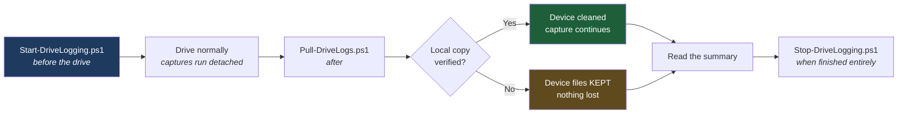

# 06 - Diagnostics

Problems in this system happen **while you are driving** and vanish by the time you are parked and holding a laptop. The tooling here exists because of that: it captures data unattended, survives everything a drive throws at it, and cleans up after itself.

---

## Why logcat alone is not enough

The video corruption in this build was invisible in app logs. The decoder never errored - it was faithfully decoding a stream that was arriving damaged. Nothing upstream complained either.

What actually diagnosed it was a **Wi-Fi link time series**: signal strength and throughput sampled every 10 seconds, alongside whether a projection session was live. The corruption showed up instantly as a signature that logcat could never have shown:

```
RSSI -25 dBm  +  Rx 1-6 Mbps   =   contention, not range
```

**Capture link quality, not just application logs.** If you take one thing from this page, take that.

---

## The tooling

| Script | What it does |
|---|---|
| [`Start-DriveLogging.ps1`](../scripts/Start-DriveLogging.ps1) | Arms both captures on the tablet, detached |
| [`Pull-DriveLogs.ps1`](../scripts/Pull-DriveLogs.ps1) | Retrieves, summarises, then cleans the device |
| [`Stop-DriveLogging.ps1`](../scripts/Stop-DriveLogging.ps1) | Kills everything and removes all traces |
| [`aa-wifi-sampler.sh`](../scripts/aa-wifi-sampler.sh) | The on-device sampler itself |

### Workflow



---

## What gets captured

### 1. Rotating logcat

```
/sdcard/Download/aa-diag/logcat.txt - all buffers, threadtime format
```

Rotation is deliberately sized. Measured idle rate is roughly **7 MB/hour**, so the original 8 × 16 MB = 128 MB ceiling held only about 18 hours - too short to catch an intermittent problem across several days. Bumped to **40 × 16 MB = 640 MB**, roughly 3-4 days.

The ceiling is a hard cap: rotation means it **cannot grow unbounded** even if you forget it entirely.

### 2. Wi-Fi link sampler

```
/sdcard/Download/aa-diag/wifi.csv - one row per 10 seconds
```

```
timestamp|ssid|rssi|link_speed|rx_speed|frequency|session=N
```

The session field comes from a direct socket-state read rather than any app log:

```sh
EST=$(cat /proc/net/tcp /proc/net/tcp6 | awk '$2 ~ /14A8$/ && $4 == "01"' | wc -l)
```

**UID-independent by design** - it survives app reinstalls and version changes, which log-scraping does not.

---

## Surviving a drive

The captures must survive adb disconnecting, the screen going off, and the tablet migrating from home Wi-Fi to the car hotspot. That is achieved with:

```bash
adb shell "nohup setsid sh -c '<command>' >/dev/null 2>&1 &"
```

`setsid` detaches from the controlling terminal so the process is not killed when the adb session ends. **Verified:** rows kept accruing through a full `adb kill-server` and a 45-second blackout.

> **They do not survive a tablet reboot.** Re-run `Start-DriveLogging.ps1` after any restart.

### Two gotchas that will waste your time

**1. Do not check the sampler with `ps`.**
```bash
adb shell "ps -A | grep aa-wifi-sampler"   # returns nothing even when it IS running
```
The process appears as plain `sh`. **Verify by watching wifi.csv row count grow instead:**
```bash
adb shell "wc -l < /sdcard/Download/aa-diag/wifi.csv"
```

**2. Git Bash mangles adb push paths.** `/data/local/tmp/` becomes `C:/Program Files/Git/data/...`. Prefix with:
```bash
MSYS_NO_PATHCONV=1 adb push aa-wifi-sampler.sh /data/local/tmp/
```

---

## Reading the results

`Pull-DriveLogs.ps1` prints a summary automatically. What each part means:

### Rx-collapse events

Samples where throughput fell below 100 Mbps. **Cross-reference every one against its RSSI** - that pairing is the entire diagnosis:

| RSSI | Rx speed | Verdict |
|---|---|---|
| Strong (better than −60) | Collapsed | **Interference / contention** - check channels |
| Weak (worse than −70) | Collapsed | **Range** - the tablet is too far, or shielded |
| Strong | Healthy | Fine |

### Frequencies seen

The tablet's associated frequency, over time.

| Reading | Meaning |
|---|---|
| Same value as the phone's station link | ⚠️ **Co-channel collision.** The bug. |
| 2.4 GHz (`24xx`) while the phone's AP is on 5 GHz | ✅ Band separation holding |
| Changing frequently | Roaming between networks - investigate |

Check it against the phone:
```bash
adb -s <PHONE> shell dumpsys wifi | grep -i frequency
```
**STA and AP must be in different bands.** Identical numbers mean you are still broken.

### Session count

Samples where a projection session was ESTABLISHED. Compare against your actual drive time - a large gap means sessions are dropping and re-establishing.

### Decoder errors

Greps for `MediaCodec` errors and codec exceptions. **Usually zero even during visible corruption** - the decoder is faithfully decoding a corrupt stream. Zero here plus visible smearing points firmly at the transport, not the decoder.

---

## Manual checks

```bash
# --- Session state ---
adb shell "cat /proc/net/tcp /proc/net/tcp6" | awk '$2 ~ /14A8$/ && $4 == "0A"'  # armed
adb shell "cat /proc/net/tcp /proc/net/tcp6" | awk '$2 ~ /14A8$/ && $4 == "01"'  # live

# --- Link quality right now ---
adb shell dumpsys wifi | grep -m1 mWifiInfo

# --- Channel collision check: run BOTH, compare bands ---
adb -s <PHONE>  shell dumpsys wifi | grep -iE "frequency"
adb -s <TABLET> shell dumpsys wifi | grep -iE "frequency"

# --- Power: is the tablet actually idle when parked? ---
adb shell dumpsys power | grep -E "mWakefulness|PARTIAL_WAKE|SCREEN_BRIGHT"

# --- Power: the check most people miss ---
adb shell "dumpsys batterystats | grep wakeupap=<uid>"
adb shell "cat /proc/$(adb shell pidof com.andrerinas.headunitrevived)/oom_score_adj"

# --- Audio routing: confirm nothing crossed to the tablet ---
adb -s <PHONE> shell dumpsys audio | grep -iE "device|focus"
```

### Healthy parked state

```
mWakefulness=Dozing
0 wakelocks
0 foreground services
oom_score_adj 900+   (cached)
```

**And check `wakeupap` too.** An app with zero wakelocks logged 1177 device-wakeup events during this build. The wakelock list alone gives a false all-clear - see [Hardware Specs](02-hardware-spec.md#power--parked).

---

## Privacy

**Drive logs contain SSIDs, BSSIDs, MAC addresses and enough network history to infer where you have been.**

- The repo's `.gitignore` excludes `drive-logs/`, `*.csv` and `logcat*.txt`. Keep it that way.
- Scrub before attaching anything to an issue.
- `Pull-DriveLogs.ps1` clears the device side after a verified pull, so nothing accumulates on a device you might sell or lend.

Minimum scrub before sharing:
```bash
sed -E 's/SSID: "[^"]*"/SSID: "REDACTED"/g; s/([0-9a-f]{2}:){5}[0-9a-f]{2}/XX:XX:XX:XX:XX:XX/gi' wifi.csv > wifi-safe.csv
```

---

## Not becoming bloatware

Logging tools have a way of quietly eating storage forever. Countermeasures built in:

| Mechanism | Effect |
|---|---|
| Rotating logcat, `-n 40` | Hard 640 MB ceiling - cannot grow past it |
| Verified-then-delete on pull | Device cleared only after the local copy is confirmed complete |
| Refuses to delete on a partial pull | A failed transfer never loses your data |
| `Stop-DriveLogging.ps1` | Removes every file and the helper script, warns about un-pulled logs first |
| Timestamped local folders | Repeated pulls never overwrite each other |

To remove every trace:
```bash
powershell -ExecutionPolicy Bypass -File scripts/Stop-DriveLogging.ps1
```

---

**Next:** [07 - Troubleshooting](07-troubleshooting.md)
