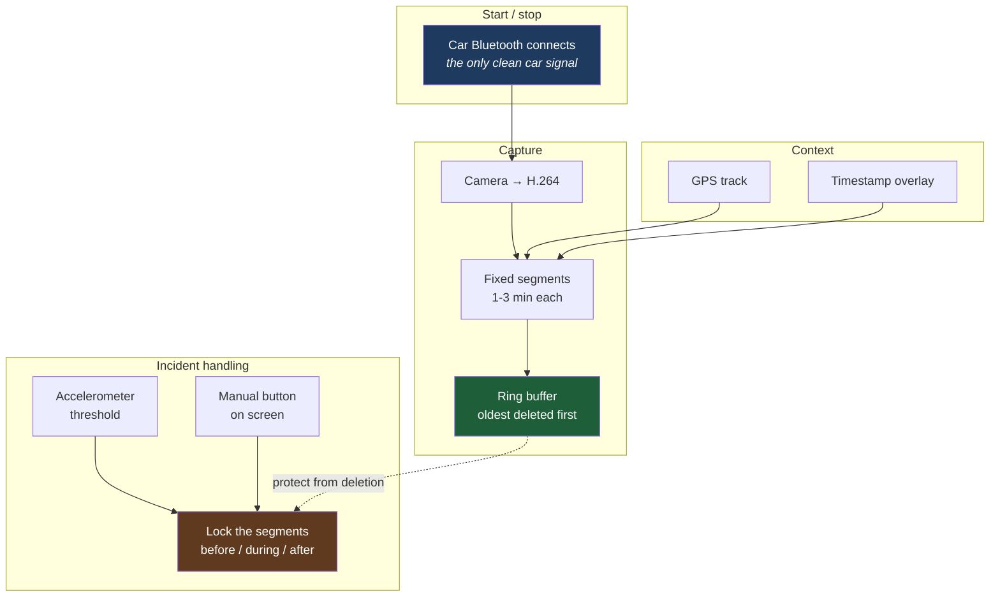

# 08 - Roadmap

Where this goes next. The current build is a display; the interesting question is what else a permanently-mounted, powered Android device in a car is good for.

> Everything below is **planned, not built.** Nothing here has been implemented or validated. Treat design sketches as hypotheses.

---

## Guiding constraints

Any new feature has to survive the same four rules that shaped the current build:

1. **Never compromise the audio path.** Audio is independent of everything else, and that is the system's best safety property. No feature gets to break it.
2. **Zero standing drain when parked.** The tablet is a daily-use device.
3. **No ambiguous triggers.** Anything automatic fires in the car and only in the car.
4. **Reversible.** No root, no vehicle wiring modifications.

A fifth appears as soon as recording enters the picture:

5. **Recording is consent-bearing.** A camera in a car captures other people. Storage, retention and sharing all need deliberate decisions, not defaults.

---

## Next up - smart dash cam

The tablet is already mounted facing forward, powered, and running an Android device with a camera and GPS. That is most of a dash cam already. What is missing is software that behaves like one.

### What separates a dash cam from a video recorder

| Requirement | Why it is non-negotiable |
|---|---|
| **Loop recording** | Fixed-size segments, oldest deleted automatically. Storage must never fill. |
| **Incident locking** | Segments around an event get protected from the loop, or the loop deletes your evidence before you get home. |
| **Automatic start and stop** | If you have to remember it, it will not be running when it matters. |
| **Never interferes with projection** | The screen is the primary function. A dash cam that drops frames from navigation is a regression. |
| **Survives power loss** | An impact can cut power. A half-written file must not corrupt the segment before it. |

### Sketch

### Open questions

**Can it record while projecting?** The unknown that decides the whole design. Camera encode and Wi-Fi video decode compete for the same media hardware and the same thermal budget. If they cannot coexist, the fallbacks are a second cheap device dedicated to recording, or recording at reduced quality.

**Thermal.** A tablet on a windscreen in the sun, decoding a video stream, encoding another, with GPS on. Sustained-load thermal behaviour needs measuring before anything is designed around it.

**Storage.** Loop sizing is a function of card size, bitrate and how long you want to retain. Also: is the card fast enough for sustained writes alongside everything else?

**Power loss.** Segment-based writing limits the damage, but the failure needs testing deliberately, not discovered after an incident.

**Which app.** Existing open-source dash cam apps may cover this without writing anything. Worth surveying first - this project's philosophy is to configure existing FOSS rather than build.

### Evaluation plan

1. Measure whether simultaneous record + project is even possible
2. Thermal test - one hour, sustained, in the sun
3. Survey existing FOSS dash cam apps against the requirements table above
4. Only then decide between configure, contribute upstream, or build

---

## Further out

### Trip logging
GPS track, duration, and route per drive. The Bluetooth trigger already marks drive boundaries cleanly, so segmentation is free. Mostly a question of what is worth storing and for how long.

### Vehicle telemetry via OBD-II
A Bluetooth OBD-II adapter exposes engine and diagnostic data. Interesting for a camping and overlanding use case - coolant temperature, battery voltage, live fuel consumption.

**Complication:** the phone's Bluetooth is already carrying A2DP to the audio dongle. Adding a data profile alongside audio needs testing - Bluetooth bandwidth and profile coexistence are both real constraints, and audio must not degrade.

### Camera integration
The vehicle already has camera displays on the 12 V rail. Whether their feeds can reach the tablet depends entirely on their output format. Analogue composite needs a capture device; IP cameras would be straightforward.

### Parking mode
Motion-triggered recording while parked. Directly conflicts with **zero standing drain**, so it would need either a dedicated always-on device or an accepted battery cost. Probably wants separate hardware rather than compromising the daily-use tablet.

### Offline maps and media
Already possible with existing apps; worth documenting as a recommended configuration for areas with no signal, since that is precisely the camping use case.

---

## Explicitly out of scope

| Not doing | Why |
|---|---|
| Rooting either device | Reversibility is a core constraint |
| Modifying vehicle wiring | Same |
| Replacing the car's head unit | The entire point is not having to |
| Custom Android Auto client | Enormous effort; upstream FOSS already works |
| Cloud upload of recordings | Privacy cost is not worth the convenience |
| Anything requiring a subscription | Free and open-source only |

---

## Contributing

The most valuable contribution right now is **different hardware**. This build is one phone, one tablet, one car. Every combination that works differently teaches something the reference build cannot.

Especially wanted:

- **Non-Samsung phones** - the STA+AP channel-forcing behaviour may differ by vendor, and that is the worst bug in the system
- **A tablet with a cellular modem** hosting the hotspot itself - would sidestep the channel collision entirely. This is the most interesting untested idea in the whole project.
- **Other head units** - different AUX behaviour, different noise profiles
- **Whether record-while-projecting works** on any device at all

Open an issue with your hardware and what happened. Include scrubbed diagnostics if you have them - see [06 - Diagnostics](06-diagnostics.md).

---

**Back to:** [README](../README.md)
